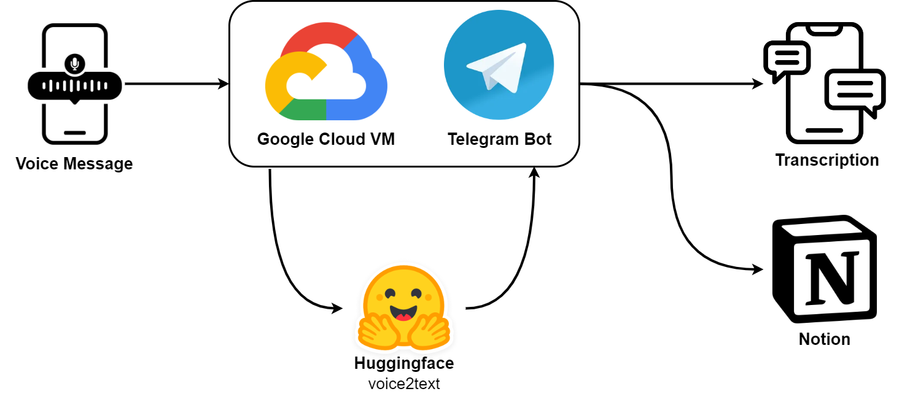

# Telegram journal bot
Personal Telegram bot for journaling.

This Telegram bot helps with daily journaling tasks. No more typing and self-organizing. The **Telegram Journal Bot** transcribes your audio and (optionally) appends it to your digital diary in Notion.

# Workflow

    

- A voice message is recorded on a messaging device and is sent in the chat with the **Telegram Journal Bot**.
- A Virtual Machine (VM) instance on Google Cloud is permanently running to host the **Telegram Journal Bot**. 
- The message is received and the audio is downloaded to the VM.
- Then, the audio file is transcribed using Huggingface.
- The transcription can now be returned via the chat (Option 1).
- Using the Notion API, the transcription is appended to a specific page for a Notion user (Option 2).

# Milestones
Current plan:  
- [x] Set up Google Cloud Platform instance.  
- [x] Set up Telegram bot via BotFather.  
- [x] Write simple Telegram bot and run locally.  
- [x] Run bot on GCP instance.  

Mile stone.

-  [x] Figure out how to access voice memos sent to Telegram bot.  
-  [x] Use Huggingface voice2text functionality to transcribe.  

Mile stone.

-  [ ] Any transcriptions should appended in a document.  
-  [ ] Set up Notion API and access a specific page.  
-  [ ] Append daily transcriptions to Notion database.  

Mile stone.

-  [ ] Scaling: Set up for multiple Telegram Bots. -> Multiple journal bots should be able to run on the same computing instance.  

Mile stone.